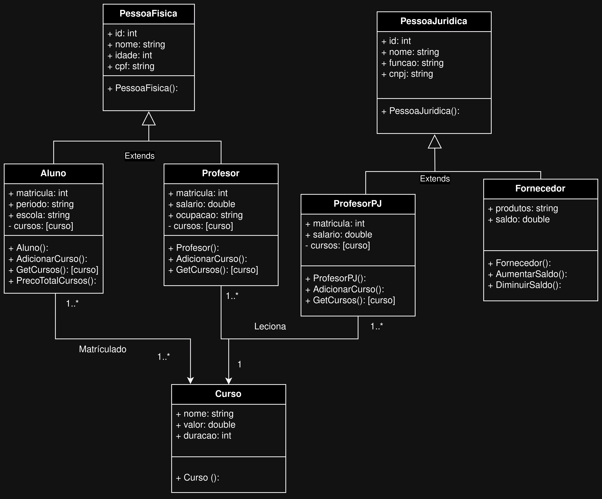
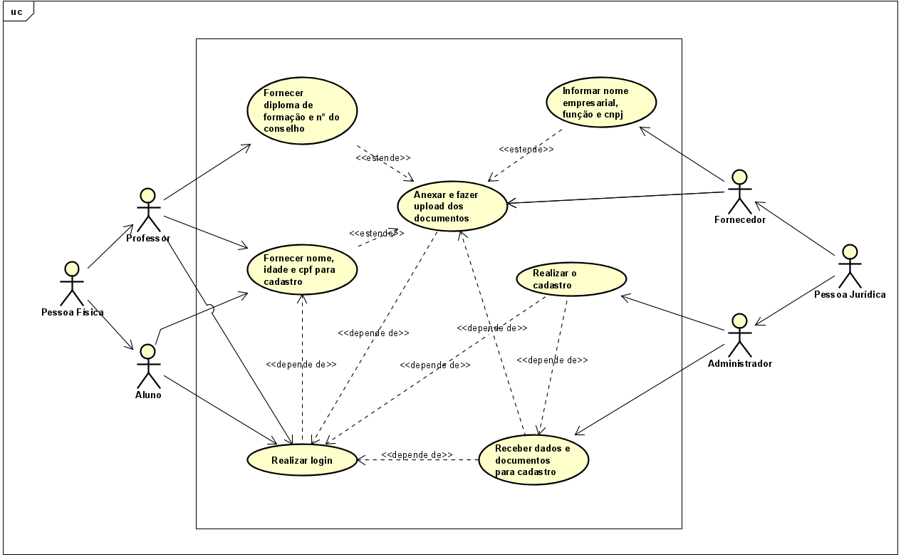
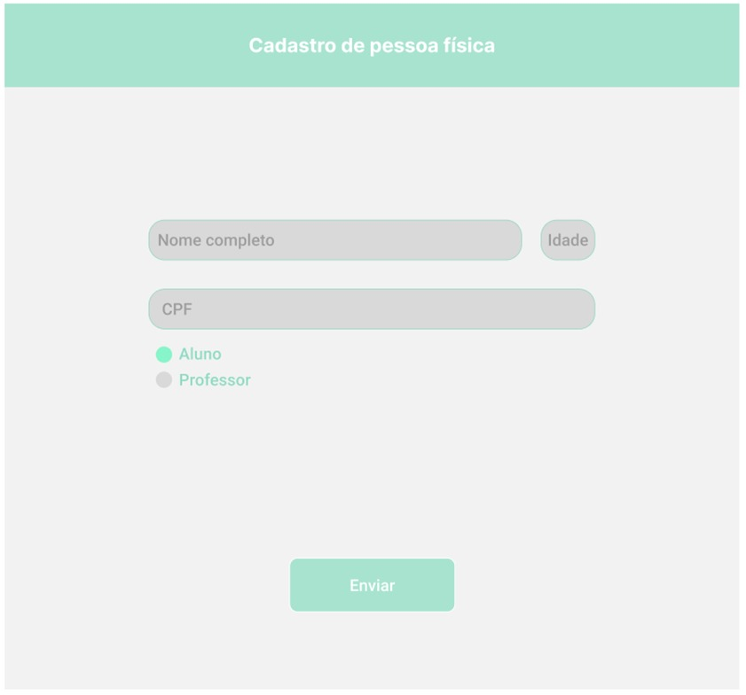
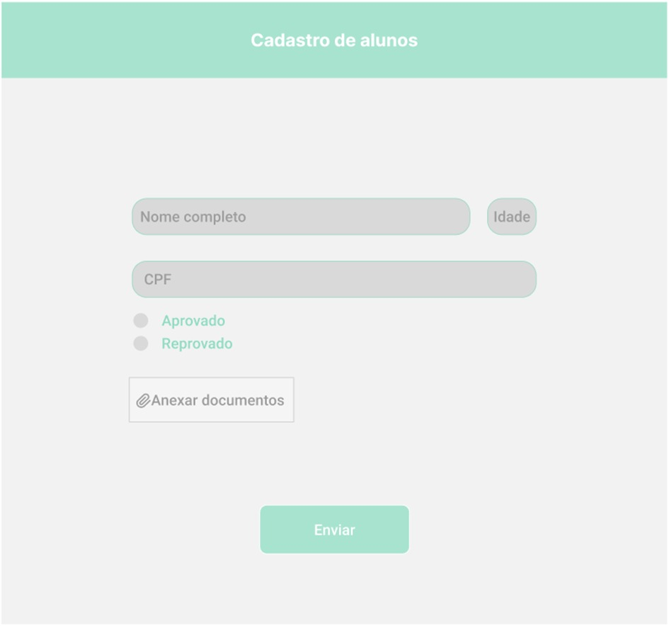
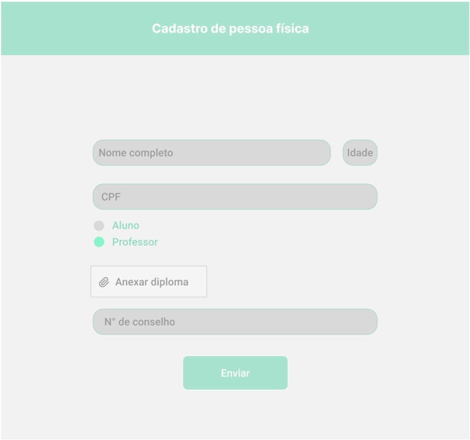
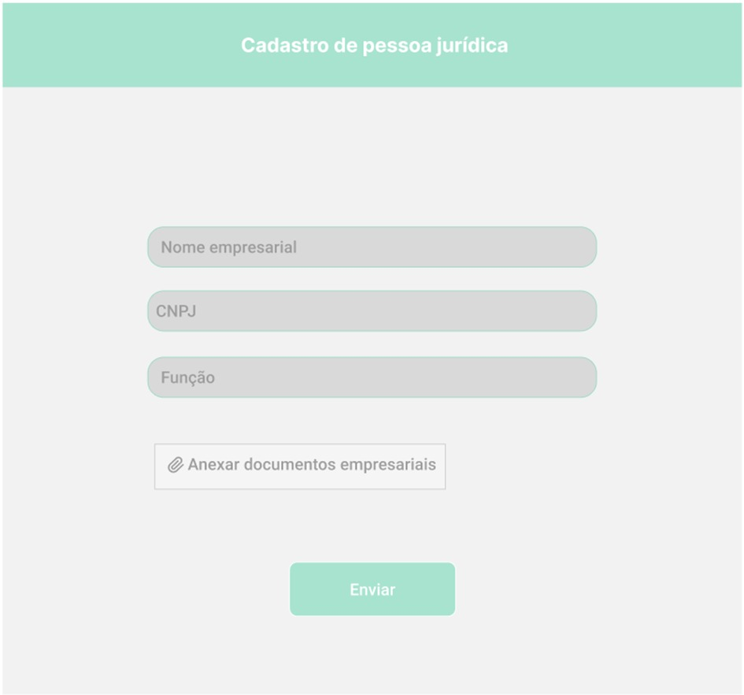
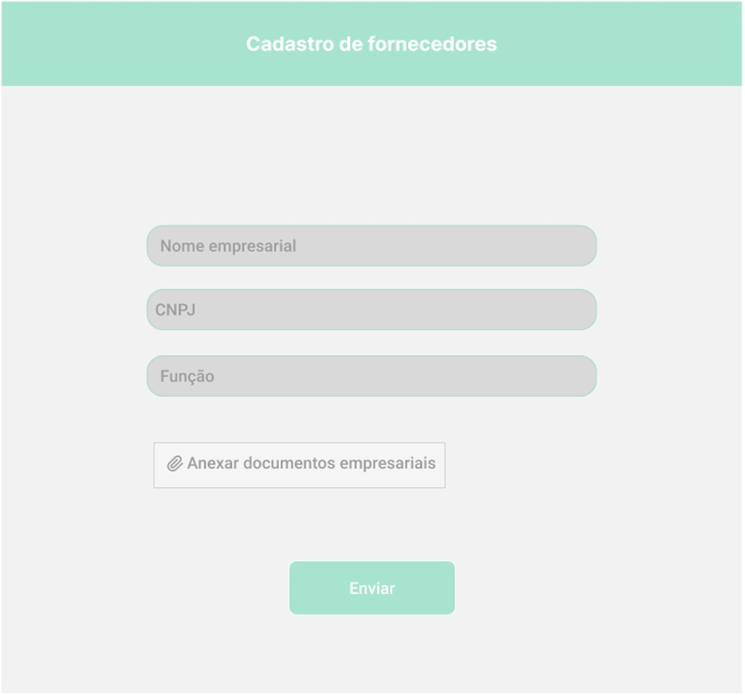
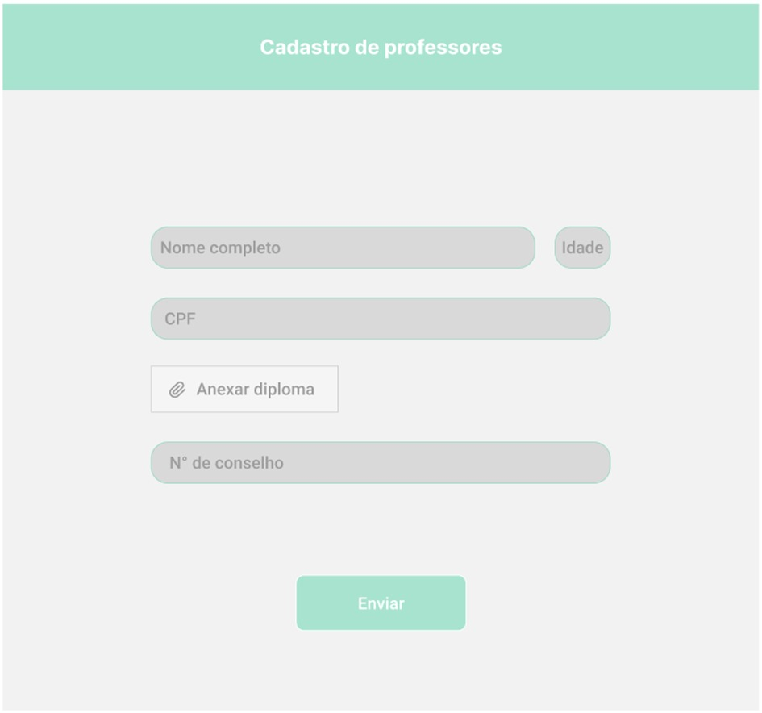

# PTI-Escola
Projeto do curso de Analise e Desenvolvimento de Sistemas do Senac EAD

# Rodar
Pra rodar a Aplicação Abra a pasta "PTI" no VSCode e Abra um Terminal Novo e digite nele "dotnet run".

Alternativamente você pode abrir a pasta no terminal e digitar o comando "dotnet run".

Usuários de Linux podem rodar o "Iniciar.sh" que ele ira abrir o programa no terminal do Sistema Operacional, basta permitir que ele seja executado como programa.

# Diagrama de Classes

O seguinte diagrama procura representar visualmente como se organiza o sistema proposto pra resolver o problema da universidade, demonstrando visualmente as classes, assim como seus respectivos atributos e métodos, e por fim as relações que possuem umas com as outra

# Diagrama de Caso de Uso
Diagrama de caso de uso envolvendo o seguinte cenário:

* Cadastro de pessoa física;
* Cadastro de pessoa jurídica;
* Cadastro de aluno;
* Cadastro de professor;
* Cadastro de fornecedor.

# Protótipos de Interface

## Cadastro de Pessoa Física

## Cadastro de Aluno

## Cadastro de Professor - Pessoa Física

## Cadastro de Pessoa Jurídica

## Cadastro de Fornecedor

## Cadastro de Professor - Pessoa Jurídica

